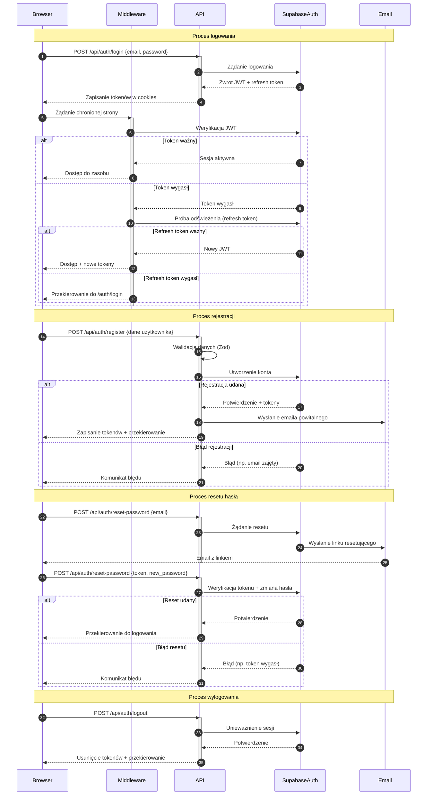

# Diagram przepływu autentykacji

```mermaid
sequenceDiagram
    autonumber
    
    participant Browser
    participant Middleware
    participant API
    participant SupabaseAuth
    participant Email

    %% Logowanie
    Note over Browser,Email: Proces logowania
    Browser->>API: POST /api/auth/login {email, password}
    activate API
    API->>SupabaseAuth: Żądanie logowania
    SupabaseAuth-->>API: Zwrot JWT + refresh token
    API-->>Browser: Zapisanie tokenów w cookies
    deactivate API
    
    Browser->>Middleware: Żądanie chronionej strony
    activate Middleware
    Middleware->>SupabaseAuth: Weryfikacja JWT
    
    alt Token ważny
        SupabaseAuth-->>Middleware: Sesja aktywna
        Middleware-->>Browser: Dostęp do zasobu
    else Token wygasł
        SupabaseAuth-->>Middleware: Token wygasł
        Middleware->>SupabaseAuth: Próba odświeżenia (refresh token)
        alt Refresh token ważny
            SupabaseAuth-->>Middleware: Nowy JWT
            Middleware-->>Browser: Dostęp + nowe tokeny
        else Refresh token wygasł
            Middleware-->>Browser: Przekierowanie do /auth/login
        end
    end
    deactivate Middleware

    %% Rejestracja
    Note over Browser,Email: Proces rejestracji
    Browser->>API: POST /api/auth/register {dane użytkownika}
    activate API
    API->>API: Walidacja danych (Zod)
    API->>SupabaseAuth: Utworzenie konta
    
    alt Rejestracja udana
        SupabaseAuth-->>API: Potwierdzenie + tokeny
        API->>Email: Wysłanie emaila powitalnego
        API-->>Browser: Zapisanie tokenów + przekierowanie
    else Błąd rejestracji
        SupabaseAuth-->>API: Błąd (np. email zajęty)
        API-->>Browser: Komunikat błędu
    end
    deactivate API

    %% Reset hasła
    Note over Browser,Email: Proces resetu hasła
    Browser->>API: POST /api/auth/reset-password {email}
    activate API
    API->>SupabaseAuth: Żądanie resetu
    SupabaseAuth->>Email: Wysłanie linku resetującego
    Email-->>Browser: Email z linkiem
    deactivate API
    
    Browser->>API: POST /api/auth/reset-password {token, new_password}
    activate API
    API->>SupabaseAuth: Weryfikacja tokenu + zmiana hasła
    
    alt Reset udany
        SupabaseAuth-->>API: Potwierdzenie
        API-->>Browser: Przekierowanie do logowania
    else Błąd resetu
        SupabaseAuth-->>API: Błąd (np. token wygasł)
        API-->>Browser: Komunikat błędu
    end
    deactivate API

    %% Wylogowanie
    Note over Browser,Email: Proces wylogowania
    Browser->>API: POST /api/auth/logout
    activate API
    API->>SupabaseAuth: Unieważnienie sesji
    SupabaseAuth-->>API: Potwierdzenie
    API-->>Browser: Usunięcie tokenów + przekierowanie
    deactivate API
``` 